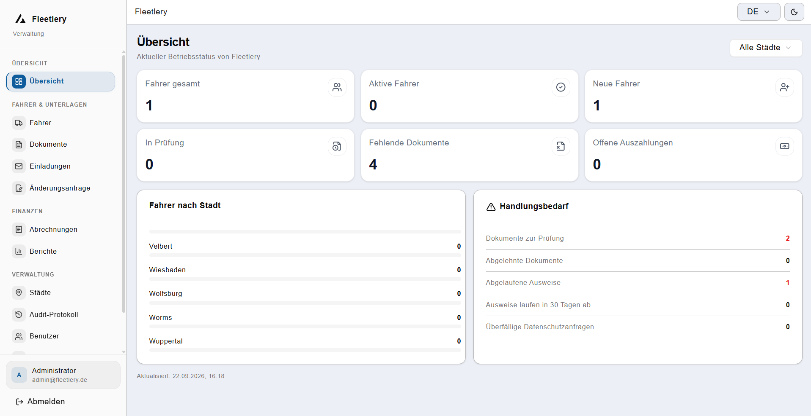

# Fleetlery Dashboard



Ein modernes Dashboard zur Verwaltung von Fahrern, ihren Dokumenten, Konten und administrativen Betriebsprozessen innerhalb eines Fleet- bzw. Fahrer-Managementsystems. Die Anwendung trennt zwischen Administrator- und Fahrerbereich, unterstützt rollenbasierte Zugriffskontrolle und bietet zentrale Funktionen für Fahrerverwaltung, Dokumentenmanagement, Abrechnungen, Berichte und Benutzeradministration.

## Überblick

Das Projekt ist als React- und TypeScript-Anwendung aufgebaut und dient als zentrale Verwaltungsoberfläche für die Steuerung von Fahrern, Dokumenten, Konten und ähnlichen Betriebsprozessen im Bereich der Fleet- und Fahrerverwaltung. Es kombiniert administrative Arbeitsabläufe mit responsivem UI-Design, modularen Komponenten und einem strukturierten Routing-/Permissions-System.

## Kernfunktionen

- Verwaltung von Fahrern und Fahrerprofilen
- Dokumenten- und Statusüberwachung
- Abrechnungs- und Settlement-Prozesse
- Audit- und Berichtsbereiche
- Rollen- und Berechtigungslogik
- Login-/Invitationsflows für Benutzer
- Mehrsprachige Oberfläche mit i18n-Unterstützung
- Layouts für unterschiedliche Ansichten und Rollen

## Rollen und Zugriff

Das System unterscheidet zwischen verschiedenen Benutzerrollen, insbesondere:

- Admin
- Driver

Die Berechtigungen werden über ein Access-Control-System definiert, das nach Rollen und Permissions prüft. Dadurch können einzelne Bereiche nur für autorisierte Benutzer freigeschaltet werden.

## Eano Framework

Eano ist ein separates Frontend-Framework für die Entwicklung moderner Webanwendungen, das von mir persönlich entwickelt wurde. Es dient als Grundlage für wiederverwendbare UI-Komponenten, Layout-Strukturen, Formular-Builder, Daten-Tabellen und gemeinsame Design-Patterns.

Im Projekt wird Eano genutzt, um die Benutzeroberfläche konsistent, modular und skalierbar zu gestalten. Es hilft dabei, wiederkehrende Lösungen zentral zu bündeln und schneller neue Verwaltungs- und Business-Screens zu entwickeln.

Wichtige Merkmale von Eano im Projekt:

- wiederverwendbare UI-Komponenten
- konsistentes Design-System
- strukturierte Layout-Templates
- Form-Builder und Data-Table-Builder
- einheitliche Patterns für Admin- und Business-Screens
- modulare Erweiterbarkeit für zukünftige Features

Eano ist damit nicht nur eine Zusatzbibliothek, sondern ein eigenes, von mir entwickeltes Framework für die moderne Frontend-Architektur dieses Projekts.

## Tech Stack

- React 19
- TypeScript
- Vite
- Tailwind CSS
- React Router
- Redux Toolkit
- Axios
- React Hook Form
- Zod
- Recharts
- TanStack React Table
- Radix UI
- i18next

## Projektstruktur

```text
fleetlery-dashboard/
├── public/
├── src/
│   ├── app/
│   ├── components/
│   ├── eano/
│   ├── i18n/
│   ├── layouts/
│   ├── pages/
│   ├── router/
│   ├── services/
│   ├── store/
│   ├── styles/
│   ├── types/
│   └── main.tsx
├── docs/
├── index.html
├── package.json
├── tsconfig.json
├── vite.config.ts
├── tailwind.config.ts
├── components.json
├── eslint.config.js
└── README.md
```

## Schnellstart

### Voraussetzungen

- Node.js 18 oder höher
- npm oder pnpm

### Installation

```bash
npm install
```

### Entwicklung starten

```bash
npm run dev
```

### Build erstellen

```bash
npm run build
```

### Linting ausführen

```bash
npm run lint
```

## Verfügbare Scripts

```bash
npm run dev      # startet den Entwicklungsserver
npm run build    # erstellt den Produktionsbuild
npm run lint     # prüft den Code mit ESLint
npm run preview  # startet die Vorschau des Builds
```

## Architektur des Frontends

Die Anwendung folgt einer modularen Architektur:

- Routing-Definitionen für Admin- und Driver-Bereiche
- AuthProvider für Authentifizierung und Benutzerkontext
- Zugriffskontrolle für Sichtbarkeit von Seiten und Funktionen
- getrennte Layout-Komponenten je nach Anwendungsbereich
- CRUD-orientierte Seiten für Unternehmensprozesse

## Beispielhafte Bereiche

- Admin-Dashboard
- Fahrerliste und Detailansichten
- Dokumentenmanagement
- Settlement-/Abrechnungsansichten
- Audit- und Systemseiten
- Einladungs- und Benutzerverwaltung
- Fahrerportal

## Hinweis zur Entwicklung

Das Projekt ist klar auf ein Business-Frontend mit professioneller Betriebslogik ausgerichtet. Für zukünftige Erweiterungen eignen sich besonders:

- zusätzliche Rollen und Berechtigungsgruppen
- erweiterte Reporting- und Exportfunktionen
- Integrationen mit Backend-APIs
- weitere modulare UI-Komponenten im Eano-Designsystem

## Lizenz

Das Projekt ist aktuell als internes bzw. privates Projekt konzipiert. Bitte vor der öffentlichen Nutzung oder Weiterverbreitung die passende Lizenz- und Nutzungsklausel mit dem Projektinhaber abstimmen.

## Fazit

Fleetlery Dashboard ist ein moderner, rollenbasierter Verwaltungsbereich für die Steuerung von Fahrern, Dokumenten, Abrechnungen und administrativen Prozessen im Fleet- und Fahrer-Management. Die Kombination aus React, TypeScript, Tailwind und dem internen Eano-Framework macht das Projekt flexibel, skalierbar und gut für geschäftsorientierte Frontend-Entwicklung geeignet.

---

Wenn du möchtest, kann ich dir als Nächstes noch eine zweite Version in einem etwas kürzeren, "GitHub-hero"-Stil erstellen, damit das README noch mehr nach einem Open-Source-Projekt aussieht.
